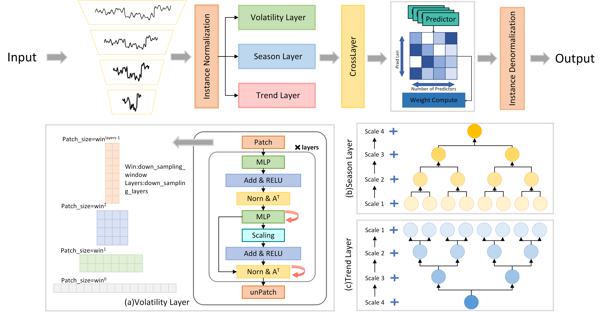

# AMSP-Net:Adaptive Multi-Scale Patch Network for Long Time-Series Forecasting

## Overview
The Adaptive Multi-Scale Patch Network (AMSP-Net) is an MLP-based method designed for long-term time series forecasting, effectively integrating multi-dimensional features across scales. It consists of three core modules: the Multi-Scale Decomposition (MSD) module, the Adaptive Scale-wise Patch-size (ASP) module, and the Adaptive Weighted Prediction (AWP) module.



## Prerequisites
To get started, ensure you are using Python 3.10. Install the necessary dependencies by running:

```pip install -r requirements.txt```

## Data Preparation
Download the required datasets from [Google Drive](https://drive.google.com/drive/folders/1ZOYpTUa82_jCcxIdTmyr0LXQfvaM9vIy). Organize the data in a folder named ./dataset as follows:

```
dataset
├── electricity
│   └── electricity.csv
├── ETT-small
│   ├── ETTh1.csv
│   ├── ETTh2.csv
│   ├── ETTm1.csv
│   └── ETTm2.csv
├── traffic
│   └── traffic.csv
└── weather
    └── weather.csv
```

## Training Example
Train the model. We provide the experiment scripts of all benchmarks under the folder ./scripts. You can reproduce the experiment results by:

```
bash ./scripts/long_term_forecast/ETT_script/AMSP-Net_ETTm1.sh
bash ./scripts/long_term_forecast/ECL_script/AMSP-Net.sh
bash ./scripts/long_term_forecast/Traffic_script/AMSP-Net.sh
bash ./scripts/long_term_forecast/Weather_script/AMSP-Net.sh
```

## Acknowledgements
We gratefully acknowledge the following GitHub repositories for their valuable contributions:

- [DLinear](https://github.com/cure-lab/LTSF-Linear)
- [Time-Series-Library](https://github.com/thuml/Time-Series-Library)
- [iTransformer](https://github.com/thuml/iTransformer)

## Contact
For any questions or inquiries, please submit an issue or contact us via email:

- Yangbo Xu(1912190224@pop.zjgsu.edu.cn)
